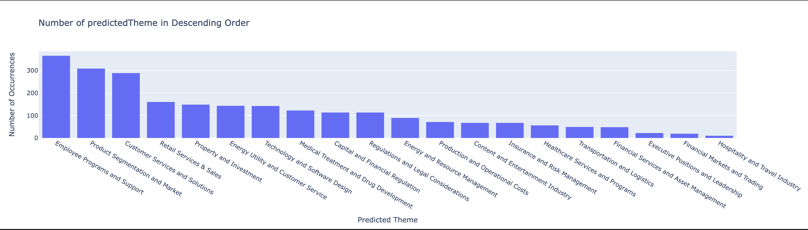
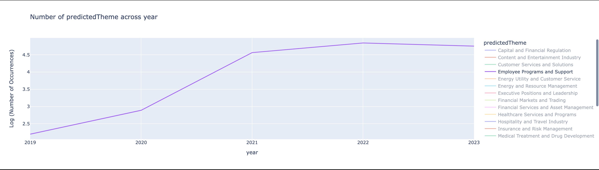

# LDA-based Theme Extraction from SEC Filings
[](https://deploy.cloud.run)

This project uses Latent Dirichlet Allocation (LDA) to extract themes from SEC filings. The model is deployed as an API service using FastAPI, allowing users to easily extract and query themes from given URLs.

## Folder Structure
thematic-analysis
├── Dockerfile
├── README.md
├── environment.yml
├── models
│   ├── bigram_mod.pkl
│   ├── lda_model
│   ├── lda_model.expElogbeta.npy
│   ├── lda_model.id2word
│   └── lda_model.state
├── plots
│   ├── SentimentAnalysis.png
│   ├── commonTopics_emerging.png
│   ├── declining_trends.png
│   └── emerging.png
├── src

│   ├── main.py
│   ├── model.py
│   ├── preprocessing.py
│   ├── scraper.py
│   ├── tests
│   │   └── test_text_preprocessing.py
│   └── themes.db
├── swagger.yml
├── thematic_analysis.ipynb

## 🚀 Setup
Please see below analysis section for basic API details and swagger.yml for spec. 

1.  **Clone the repository**:

```    
git clone https://github.com/joelcpy/thematic-analysis.git
cd thematic-analysis
``` 

2.  **Build the Docker container**:
    
```
docker build -t theme-extractor . 
```
    
    
3.  **Run the Docker container**:
    
```
docker run -p 8000:8000 theme-extractor
```
    

## Analysis Findings
### 1. Common topics
0. **Employee Programs and Support**
   - Keywords: employee, company, program, work, business, support, diversity
   - Theme: This topic seems to be about employee-related programs, support, and diversity initiatives within the company.
   
1. **Medical Treatment and Drug Development**
   - Keywords: product, treatment, patient, patent, development, clinical, drug
   - Theme: This topic revolves around medical treatments, drug development, and clinical trials.

2. **Technology and Software Design**
   - Keywords: product, system, design, technology, software, device, application
   - Theme: This topic focuses on technology and software design, including systems and applications.

3. **Financial Markets and Trading**
   - Keywords: market, trading, exchange, trade, datum, clearing, platform
   - Theme: This topic relates to financial markets, trading, and exchange platforms.

4. **Production and Operational Costs**
   - Keywords: contract, company, production, cost, operation, estimate, government
   - Theme: This topic likely concerns production, contracts, and operational costs.

5. **Executive Positions and Leadership**
   - Keywords: officer, vice, chief, serve, executive, president, senior, director
   - Theme: This topic pertains to executive positions and leadership roles within the organization.

6. **Customer Services and Solutions**
   - Keywords: service, customer, solution, business, technology, provide
   - Theme: This topic covers customer services and solutions, including technology-related offerings.

7. **Energy and Resource Management**
   - Keywords: gas, natural, pipeline, oil, facility, operation, capacity
   - Theme: This topic revolves around energy resources, including gas, oil, and facility operations.

8. **Hospitality and Travel Industry**
   - Keywords: hotel, brand, travel, gaming, ship, resort, restaurant, guest
   - Theme: This topic is about the hospitality and travel industry, including hotels, resorts, and gaming.

9. **Transportation and Logistics**
   - Keywords: service, carrier, customer, shipment, transportation, airline, aircraft
   - Theme: This topic relates to transportation services, carriers, and logistics.

10. **Insurance and Risk Management**
    - Keywords: insurance, company, risk, business, loss, claim, coverage
    - Theme: This topic focuses on insurance-related matters, including risk and coverage.

11. **Property and Investment**
    - Keywords: property, income, investment, lease, tax
    - Theme: This topic likely concerns property, investments, and income-related matters.

12. **Retail Services & Sales**
    - Keywords: product, store, brand, sale, customer, sell
    - Theme: This topic relates to retail services and sales.

13. **Content and Entertainment Industry**
    - Keywords: service, content, network, company, license, entertainment, advertising
    - Theme: This topic relates to content and entertainment services, including networks and licenses.

14. **Healthcare Services and Programs**
    - Keywords: health, care, service, medical, dental, program, healthcare, provider
    - Theme: This topic is about healthcare services, care programs, and medical providers.

15. **Financial Services and Asset Management**
    - Keywords: client, investment, service, management, fund, asset, financial
    - Theme: This topic focuses on financial services, investment management, and assets.

16. **Capital and Financial Regulation**
    - Keywords: capital, financial, bank, risk, company, rule, banking
    - Theme: This topic pertains to capital, financial institutions, and regulations.

17. **Regulations and Legal Considerations**
    - Keywords: regulation, law, subject, requirement, risk
    - Theme: This topic concerns regulations, legal considerations, and associated risks.

18. **Product Segmentation and Market**
    - Keywords: product, company, segment, market, business, material, customer
    - Theme: This topic is about product segmentation, markets, and customer considerations.

19. **Energy Utility and Customer Service**
    - Keywords: energy, utility, customer, electric, gas, service, power, cost
    - Theme: This topic covers energy utilities, customer services, and power-related aspects.

#### Top 5
Employee Programs and support, product segmentation and market, customer services and solutions, retail services and sales, property and investments


### 2. Emerging Topics across time
Employee programs and support dominated after covid




### 3. Declining themes
4 major themes
content and entertainment industry
executive positions and leadership
hospitality and travel
retail services and sales


### 4. Sentiment analysis
Product segmentation and market are more positive than the rest


## API Endpoints

### 1\. Extract Theme

*   **Endpoint**: `/extract-theme/`
*   **Method**: `POST`
*   **Description**: Extracts text from the provided URL, predicts the theme of the content, and saves the URL, text, and theme into a SQLite database.
*   **Payload**:
    
    
```
https://www.sec.gov/Archives/edgar/data/1267238/000126723822000006/aiz-20211231.htm
```

    
*   **Response**:
  ```
  {
  "url": "https://www.sec.gov/Archives/edgar/data/1267238/000126723822000006/aiz-20211231.htm",
  "theme": "Employee Programs and Support"
}
  ```
    

### 2\. Get Predicted Themes

*   **Endpoint**: `/themes/`
*   **Method**: `GET`
*   **Description**: Retrieve a list of all extracted themes from the database.
*   **Response**:
```
[
  "Employee Programs and Support",
  "Employee Programs and Support",
  "Employee Programs and Support",
  "Property and Investment",
  "Retail Services & Sales",
  "Employee Programs and Support",
  "Employee Programs and Support"
]

```

    

### 3\. Get Texts by Theme

*   **Endpoint**: `/texts/{theme_name}/`
*   **Method**: `GET`
*   **Description**: Retrieve a list of text bodies associated with a specific theme.
*   **Response**:
    
```
{
  "themes": [
    {
      "url": "https://www.sec.gov/Archives/edgar/data/1267238/000126723822000006/aiz-20211231.htm",
      "text_body": "Assurant, Inc. was incorporated as a Delaware corporation in 2004.We are a leading global provider of lifestyle and housing solutions that support, pr ...",
      "theme": "Employee Programs and Support"
    },
    {
      "url": "https://www.sec.gov/Archives/edgar/data/1267238/000126723822000006/aiz-20211231.htm",
      "text_body": "Assurant, Inc. was incorporated as a Delaware corporation in 2004.We are a leading global provider of lifestyle and housing solutions that support, pr ...",
      "theme": "Employee Programs and Support"
    },
    {
      "url": "https://www.sec.gov/Archives/edgar/data/1267238/000126723822000006/aiz-20211231.htm",
      "text_body": "Assurant, Inc. was incorporated as a Delaware corporation in 2004.We are a leading global provider of lifestyle and housing solutions that support, pr ...",
      "theme": "Employee Programs and Support"
    },
    {
      "url": "https://www.sec.gov/Archives/edgar/data/1267238/000126723822000006/aiz-20211231.htm",
      "text_body": "Assurant, Inc. was incorporated as a Delaware corporation in 2004.We are a leading global provider of lifestyle and housing solutions that support, pr ...",
      "theme": "Employee Programs and Support"
    },
    {
      "url": "https://www.sec.gov/Archives/edgar/data/1267238/000126723822000006/aiz-20211231.htm",
      "text_body": "Assurant, Inc. was incorporated as a Delaware corporation in 2004.We are a leading global provider of lifestyle and housing solutions that support, pr ...",
      "theme": "Employee Programs and Support"
    },
    {
      "url": "https://www.sec.gov/Archives/edgar/data/1267238/000126723822000006/aiz-20211231.htm",
      "text_body": "Assurant, Inc. was incorporated as a Delaware corporation in 2004.We are a leading global provider of lifestyle and housing solutions that support, pr ...",
      "theme": "Employee Programs and Support"
    }
  ]
}
```

## Test
```
# change to src directory and execute the test scripts
cd src
python -m unittest tests/test_text_preprocessing.py
```

